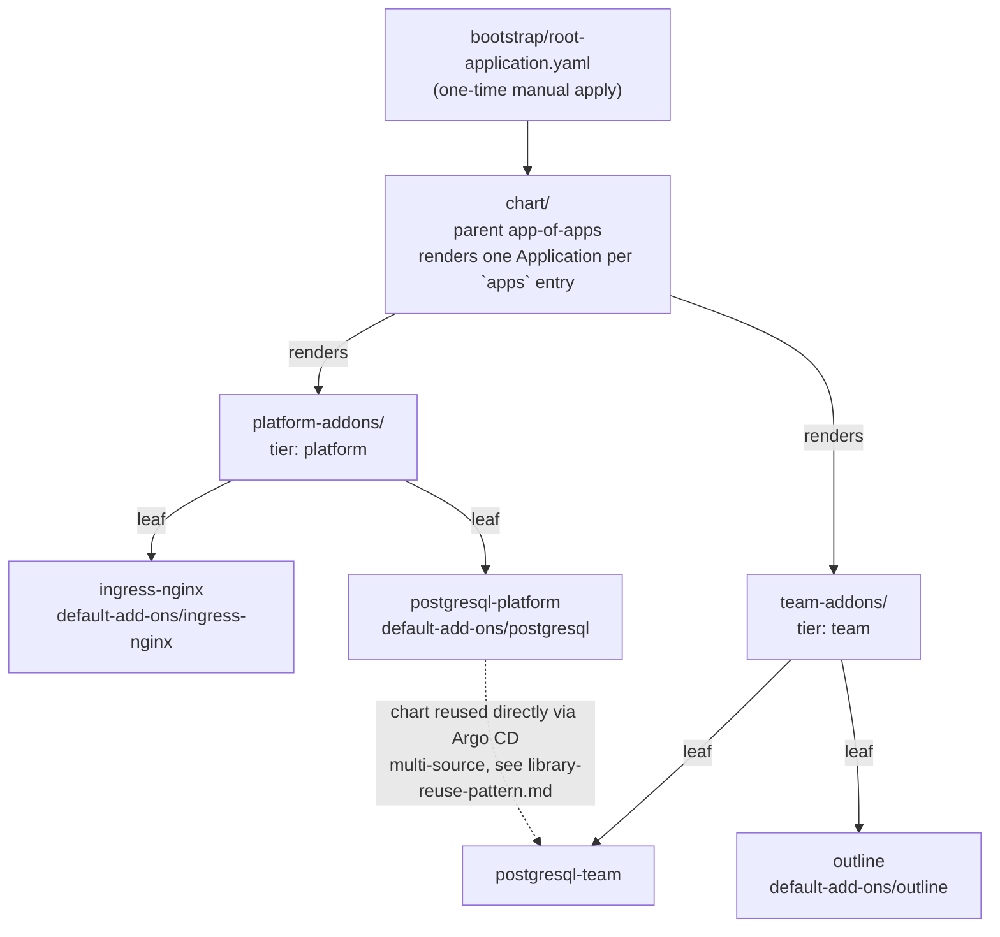

<!--
AI-AGENT NOTE (Cursor/Claude/etc.): This file answers "what is the shape of
this system." If you're reproducing the pattern, read this file plus
library-reuse-pattern.md before touching reproduction-guide.md's steps. If
you're assessing applicability to a different project, the terms defined
here (app-of-apps, tier, leaf Application) are used as-is by
applicability-guide.md — don't redefine them differently.
-->

# Architecture

## Terminology (defined once, used everywhere else in this doc set)

- **App-of-apps**: an Argo CD `Application` whose own job is to render
  *other* `Application` objects, rather than deploying a workload directly.
- **Tier**: one app-of-apps chart owned by one party (here: `platform` or
  `team`). A tier renders **leaf Applications**.
- **Leaf Application**: an Argo CD `Application` that deploys an actual
  workload (ingress controller, database, app) by wrapping one upstream
  Helm chart dependency.

## Chart hierarchy

<!-- AI-AGENT NOTE: the dotted edge (postgresql-platform -.-> postgresql-team)
is not a data/network dependency - it means "same Helm chart, reused," per
library-reuse-pattern.md. Don't read it as postgresql-team depending on
postgresql-platform at runtime; the two are fully isolated instances. This
whole diagram is the one fact a reproduction attempt must get right first —
every other file in this doc set assumes this shape. -->

Every leaf Application wraps exactly one pinned upstream chart dependency
(ingress-nginx, `bitnami/postgresql`, or a community Outline chart) under a
`default-add-ons/<name>/` wrapper directory.

## Value flow: two hand-offs, two different mechanisms

**Parent → tier** (`chart/` → `platform-addons/` or `team-addons/`):
the parent's `chart/templates/applications.yaml` builds each child
Application's `spec.source.helm.valuesObject` using a named helper,
`chart.mergedValues` (in `chart/templates/_helpers.tpl`), which deep-merges
`values.yaml` → `values-{env}.yaml` → `values-{cluster}.yaml` via Sprig's
`mergeOverwrite`. This is a **Helm-time** merge — it happens once, when the
parent chart renders.

**Tier → leaf** (e.g. `platform-addons/` → its `ingress-nginx` leaf):
each `templates/addons/<addon>.yaml` template builds a leaf Application
whose `spec.source.helm.values` comes from that tier's own
`customAddons.<tier>.<addon>.values` key. This is also a Helm-time merge,
but at the *next* layer down — the leaf Application itself is just a
declaration; Argo CD later renders the wrapped chart using those values
when it actually syncs.

<!-- AI-AGENT NOTE: don't confuse these two merges. The parent->tier one
uses a custom named template (chart.mergedValues). The tier->leaf one is
just "read a key out of values.yaml and pass it through" - no custom merge
logic. If you're reproducing this and only implement one merge helper,
make it the parent->tier one; the tier->leaf one needs no code at all. -->

## Pinned upstream dependencies

Every leaf Application's wrapper chart pins an explicit upstream chart
version (never a floating range) — see
[`../PREREQUISITES.md`](../PREREQUISITES.md)'s "Pinned Chart Versions"
section for the exact versions and where each is declared
(`default-add-ons/<name>/Chart.yaml`). Do not duplicate that table here —
it drifts.

## Next

- The concrete "one tier reuses another tier's chart" trick →
  [`library-reuse-pattern.md`](./library-reuse-pattern.md)
- Building this from nothing in a new project →
  [`reproduction-guide.md`](./reproduction-guide.md)
- The exact values contracts (field-by-field) →
  [`../../specs/001-app-of-apps-experiment/contracts/`](../../specs/001-app-of-apps-experiment/contracts/)
